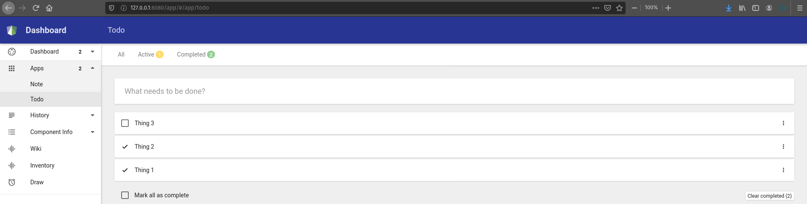

### Overview
A sample application showing how to build applications in [node](https://nodejs.org/en/) using [material theme](https://material.io/articles/how-google-created-a-custom-material-theme).
- Note taking application
- A simple TODO list

### Pre-requisites
- Nodejs
- NPM
  
### Build
1. Run the following command to install **bower** and **grunt** cli tools.
   ```
   npm install -g bower grunt-cli
   ```
2. Run the following command to install the project dependencies.
   ```
   bower install
   ```
3. Run the following command to build the project.
   ```
   grunt build:angular
   ``` 

### Run the application
To start the application locally, run the following command.
 ```
 npm start
 ``` 

### Launch the application

1: Put all the files on a local server (must include the "app" and "libs" folder)
2: Open "http://localhost/app/" in browser


### Preview
#### TODO List


#### Dashboard


#### Note 
